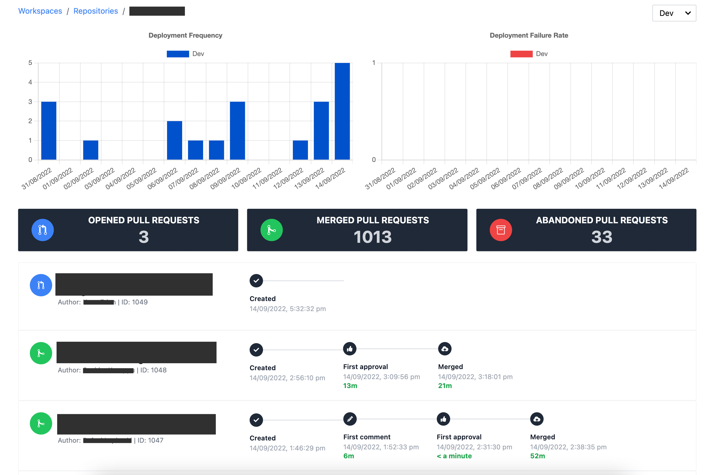

# Introduction

Bitbucket DORA metrics is web application built using React. It provides a dashboard to show how the team is performing based on deployments and pull requests from Bitbucket.

DORA metrics are metrics to measure the performance of a software development team. These are the four DORA key metrics:

- Deployment Frequency
- Lead Time for Changes
- Change Failure Rate
- Time to Restore Service

# Dashboard

# Authorization

The authorization for the application is using Bitbucket app password. Click [here](https://support.atlassian.com/bitbucket-cloud/docs/app-passwords/) and follow the instructions on how to generate app password on your bitbucket account.

Make sure the app password have `Read` permission for the following:

- Accounts
- Workspaces
- Pull Requests
- Projects
- Repositories
- Pipelines

# How to run the application

In the project directory, you can run:

`npm start`

Runs the app in the development mode.
Open [http://localhost:3000](http://localhost:3000) to view it in the browser.

`npm run test`

Runs all the tests the app have.

`npm run build`

Builds the app for production to the `build` folder.\
It correctly bundles React in production mode and optimizes the build for the best performance.

The build is minified and the filenames include the hashes.\
Your app is ready to be deployed!

See the section about [deployment](https://facebook.github.io/create-react-app/docs/deployment) for more information.

# Future

- Date filter
- Data comparison between dates
- Metrics average
- Lead time for changes (First commit / first PR -> Production)
- Time to restore service
- Change failure rate
